# Plan: Agentic MLOps on Snowflake (Predictive Maintenance)

## Build status (validated live in Snowflake)
- **DONE:** Tasks 1-5, 7, 8, 9, 10. Notebook -> modular pipeline -> ML Jobs -> Task Graph DAG (DEV + PROD) -> canary + A/B monitor -> promotion.
- **PROD result:** `AI_DEMOS_PROD` registry has V1 (LogReg) + V2 (XGBoost). Canary A/B: **V2 wins** (F1 0.55 vs 0, precision 1.0 vs 0, accuracy ~0.97 both, PSI 0.52). Gateway shifted to V2; `PRODUCTION` alias on V2.
- **DEFERRED:** Task 6 (GitHub Actions + Snowflake Git repository) - explained in `DEMO_RUNBOOK.md` section 4, not implemented.
- **On-stage script + concepts + CoCo prompts:** `DEMO_RUNBOOK.md`.
- **Artifacts:** `notebooks/end-2-end-mlops-demo.ipynb`; `src/pdm_pipeline/*`; `src/demo_functions/*` (db-parametrized); `scripts/{run_pipeline,submit_step,submit_pipeline,dag,deploy_services,simulate_traffic}.py`; `infra/{setup_compute,create_gateway,create_monitor}.sql`, `infra/{generate_prod_data,check_network_policy}.py`.

## Narrative (personas)
- A **Data Scientist** built `notebooks/end-2-end-mlops-demo.ipynb` in **Snowsight Workspaces** (DEV = `AI_DEMOS.IOT_PREDICTIVE_MAINTENANCE`). This notebook is the **given input**.
- An **ML Engineer** productionizes it with **Cortex Code agentic MLOps + the `machine-learning` skill**: modularize -> remote ML Jobs -> scheduled Task Graph -> git promotion DEV->PROD -> canary rollout of two models.
- **Everything runs in Snowflake.** Local IDE via the **VS Code Remote Development extension (Private Preview)** is a documented **next step**.

```mermaid
flowchart LR
  DS["Data Scientist\n(Snowsight Workspaces)"] --> NB["end-2-end notebook\nDEV = AI_DEMOS"]
  NB --> MLE["ML Engineer\n+ Cortex Code /machine-learning"]
  MLE --> PKG["Modular package\nprepare / train_v1 / train_v2 / evaluate / notify"]
  PKG --> JOBS["ML Jobs on compute pool (CPU)"]
  JOBS --> DAG["Task Graph (scheduled DAG)"]
  DAG --> GIT["Git promotion DEV to PROD"]
  GIT --> PROD["PROD = AI_DEMOS_PROD\nrun both train scripts -> register V1 + V2"]
  PROD --> CANARY["Gateway canary 90/10\nV1 LogReg vs V2 XGBoost + A/B monitors"]
  CANARY --> WIN["Promote winner\n100% traffic + PRODUCTION alias"]
```



## Simplified model + promotion strategy (confirmed)
- **Promote the scripts, not the pickle** -> pipeline code is the source of truth, versioned in **git** (deck slide 1).
- **Two train scripts, two models (different algorithm):**
  - `train_v1.py` -> **LogisticRegression** -> model version **V1** (baseline).
  - `train_v2.py` -> **XGBoost** classifier -> model version **V2** (candidate).
  - Both already exist in the notebook's `train_models()`; we split them into two scripts.
- **Run in PROD on PROD data**: both scripts run in `AI_DEMOS_PROD`, registering V1 and V2 in the PROD registry.
- **Compare live via canary**, then **promote the winner**: shift Gateway traffic to 100% and set the `PRODUCTION` alias to the winning version. (Alias is the last-mile promotion, decided by the canary/A-B result.)

## Environments (confirmed: DEV -> PROD only)
| Env | Database | Compute pool | Warehouse | Data |
|-----|----------|--------------|-----------|------|
| DEV | `AI_DEMOS` (existing) | `SYSTEM_COMPUTE_POOL_CPU` | `AI_WH` | DEV dataset via `demo_functions.setup` |
| PROD | `AI_DEMOS_PROD` | `PDM_POOL_PROD` | `PDM_WH_PROD` | generated the **same way as the notebook** (same params), independent draw |

- Data windows (match the notebook): training uses the notebook's windows; **serving/scoring window = `start_date='2025-04-01'`, `end_date='2026-07-10'`**.
- `demo_flow.setup()` / `generate_machine_data()` get a small `database` parameter (default `AI_DEMOS`) so they can target `AI_DEMOS_PROD`. STAGING objects stay provisioned but unused.
- Compute pools + warehouses already provisioned (`infra/setup_compute.sql`).

---

## Tasks

### Task 1 — Create PROD env + data (AI_DEMOS_PROD)  [IN PROGRESS]
- Parametrize `src/demo_functions/demo_flow.py`: add `database='AI_DEMOS'` to `setup()` and `generate_machine_data()`, replacing the hardcoded `AI_DEMOS` (backward compatible; DEV notebook unaffected).
- `CREATE DATABASE AI_DEMOS_PROD` (+ schemas created by `setup`).
- Generate PROD data with the same params as the notebook (200 machines, drift `2025-06-01`); serving window `2025-04-01`..`2026-07-10`.
- Update notebook `ENV_CONFIG["PROD"]["database"] = "AI_DEMOS_PROD"`.

### Task 2 — Data Scientist artifact (DONE, verify in Snowflake)
- Dual-mode notebook runs in **Snowsight Workspaces** (confirmed), local VS Code, and VS Code Remote-Dev-on-SPCS.
- DEV artifacts: model `PREDICTIVE_MAINTENANCE_MODEL` V1, feature view `MACHINE_SENSORS_LAG_FEATURES`, SPCS service, monitor.

### Task 3 — Agentic refactor notebook -> modular package (slide 7)
Drive Cortex Code `/machine-learning` skill to split the notebook into typed modules:
```
src/pdm_pipeline/
  common.py       # dual-mode session + ENV_CONFIG + shared config
  prepare_data.py # Function (Warehouse) -> dataset version(s)
  train_v1.py     # ML Job (CPU pool) -> LogisticRegression -> register V1
  train_v2.py     # ML Job (CPU pool) -> XGBoost -> register V2
  evaluate.py     # ML Job / Notebook -> metrics for V1 & V2
  notify.py       # FINALIZER (Warehouse)
submit/ (submit_pipeline.py, upload ZIP), pipeline.yaml
```

### Task 4 — Remote execution as Snowflake ML Jobs (CPU)
- `submit_directory(..., compute_pool=PDM_POOL_{ENV}, entrypoint="train_v1.py"/"train_v2.py", imports=[("src/pdm_pipeline/","pdm_pipeline")])`; file jobs return `model_version` via `__return__`.
- `job.result()/status/get_logs`. Prereq: payload stage + (if pip needed) an EAI.

### Task 5 — Scheduled Task Graph with typed steps + FINALIZER (slides 2 & 4)
- Root `prepare_data` (Function/WH) -> `train_v1` + `train_v2` (ML Jobs via `DAGTask(definition=@remote fn)`, run in parallel) -> `evaluate` (Notebook/pool) -> `notify` **FINALIZER** (WH).
- Pass versions with `SYSTEM$SET_RETURN_VALUE` / `SYSTEM$GET_PREDECESSOR_RETURN_VALUE`; show the Snowsight run view.

### Task 6 — Git integration + CI/CD trigger (slide 1)
- **Snowflake Git repository** (`CREATE GIT REPOSITORY`); Workspaces/tasks run `EXECUTE IMMEDIATE FROM @repo/...`.
- **GitHub Actions** (key-pair auth): merge to `main` -> deploy to PROD; CI detects changed dirs and deploys feature views + project.

### Task 7 — Promote DEV -> PROD (code + run both train scripts)
- Deploy promoted pipeline to PROD (git). Run `train_v1.py` and `train_v2.py` in PROD on PROD data -> register **V1 (LogReg)** and **V2 (XGBoost)** in the PROD registry.

### Task 8 — Canary rollout in PROD via native Snowflake Gateway (slide 8)
- Deploy V1 + V2 as SPCS services with **auto-capture on** (`PDM_POOL_PROD`), consistent output signature (`FAILURE_IN_1_DAY_PREDICTION`).
- `CREATE GATEWAY pdm_gateway ... type: traffic_split, split_type: custom` weights 90/10 (stable ingress URL).
- Progressive `ALTER GATEWAY` 90/10 -> 50/50 -> 0/100; promote winner (100% + set `PRODUCTION` alias) or rollback.

### Task 9 — A/B gateway monitors: compare V1 vs V2 (slide 8)
- `CREATE MODEL MONITOR` on the gateway; compare with `MODEL_MONITOR_DRIFT_METRIC(SERVICE=>, BASE_SERVICE=>)` and `MODEL_MONITOR_PERFORMANCE_METRIC(...)`. Both are binary classifiers (supported).

### Task 10 — Demo runbook + CoCo prompt script + IDE next step
- `DEMO_RUNBOOK.md`: on-stage sequence + **verbatim CoCo prompt tables (slides 7 & 8)**.
- Next step: run the notebook from a local IDE via the **VS Code Remote Development extension (Private Preview)** on Snowflake compute; same `get_active_session()` works unchanged.

## Verification
- Task 1: `AI_DEMOS_PROD.<schema>.MACHINE_SENSORS` / `MACHINE_FAILURES` populated; row counts shown.
- Tasks 4-5: `job.result()` returns V1/V2 metrics; task-graph run shows all steps + return values.
- Task 7: PROD registry shows V1 and V2.
- Tasks 8-9: gateway `ingress_url` routes ~90/10; monitor metric functions return per-service drift/perf for V1 vs V2.

## Critical files
- `notebooks/end-2-end-mlops-demo.ipynb` - DS input artifact (dual-mode).
- `src/demo_functions/demo_flow.py` - parametrize `database` (Task 1).
- `src/pdm_pipeline/*` - modular pipeline incl. `train_v1.py` (LogReg) + `train_v2.py` (XGBoost).
- `pipeline.yaml` + `submit/submit_pipeline.py` - task-graph + ML Job orchestrator.
- `infra/setup_compute.sql` - per-env compute (done); add PROD DB + data-gen.
- `DEMO_RUNBOOK.md` - prompt script + IDE next step.

## Notes
- Reconciled against the 8 presentation slides.
- Simplified: two models differ by **algorithm** - V1 LogisticRegression (baseline) vs V2 XGBoost (candidate); they are the canary A/B pair.
- Confirmed: PROD DB = `AI_DEMOS_PROD`; DEV -> PROD only; serving window `2025-04-01`..`2026-07-10`.
- GPU dropped; all ML Jobs + services on CPU pools.

## Running the pipeline (commands)
All commands use the base conda python with the `oregon_tp` connection. `PDM_ENV` selects the environment (`DEV` default, `PROD`).

**1. Run a single step as an ML Job** (test steps independently):
```bash
SNOWFLAKE_CONNECTION_NAME=oregon_tp PDM_ENV=DEV \
  python scripts/submit_step.py prepare_data
# other steps: train_v1 | train_v2 | evaluate
```

**2. Run all steps sequentially as ML Jobs** (one session/one login):
```bash
SNOWFLAKE_CONNECTION_NAME=oregon_tp PDM_ENV=DEV \
  python scripts/submit_pipeline.py
# subset only:
SNOWFLAKE_CONNECTION_NAME=oregon_tp PDM_ENV=DEV PDM_STEPS=train_v1,train_v2,evaluate,notify \
  python scripts/submit_pipeline.py
```

**3. Submit as a DAG (Task Graph)** — each step becomes a `DAGTask` backed by an ML Job:
```bash
# Deploy only (defines + registers the Task Graph, does not run it):
SNOWFLAKE_CONNECTION_NAME=oregon_tp PDM_ENV=DEV python scripts/dag.py

# Deploy AND trigger a run now:
SNOWFLAKE_CONNECTION_NAME=oregon_tp PDM_ENV=DEV python scripts/dag.py --run
```
Graph: `PREPARE_DATA -> [TRAIN_V1, TRAIN_V2] -> EVALUATE -> NOTIFY`. Watch it in Snowsight -> Monitoring -> Task History (or `information_schema.task_history`). Promote to PROD by running the same with `PDM_ENV=PROD` (via CI/CD).

### Headless auth
`oregon_tp` uses `externalbrowser` (SSO). To avoid a browser login on every Python process:

- **DEV / local (enabled now):** SSO token caching is on for `oregon_tp` in `~/.snowflake/connections.toml`:
  ```toml
  authenticator = "externalbrowser"
  client_store_temporary_credential = true   # caches token in macOS keychain after 1 login
  ```
  First run opens the browser once; subsequent runs reuse the cached token until it expires.

- **PROD / CI/CD (recommended): key-pair auth (fully headless, no browser).** Use a dedicated service account + RSA key, never interactive SSO:
  ```bash
  # 1. generate key pair
  openssl genrsa 2048 | openssl pkcs8 -topk8 -inform PEM -out ~/.snowflake/keys/rsa_key.p8 -nocrypt
  openssl rsa -in ~/.snowflake/keys/rsa_key.p8 -pubout -out ~/.snowflake/keys/rsa_key.pub
  # 2. register the public key on the (service) user
  #    ALTER USER <svc_user> SET RSA_PUBLIC_KEY='<contents of rsa_key.pub, no header/footer>';
  # 3. add a headless connection
  snow connection add --connection-name oregon_tp_jwt --account <acct> --user <svc_user> \
    --authenticator SNOWFLAKE_JWT --private-key ~/.snowflake/keys/rsa_key.p8
  ```
  Run any pipeline command with `SNOWFLAKE_CONNECTION_NAME=oregon_tp_jwt` - no browser. In GitHub Actions, store the private key as an encrypted secret and use OIDC/key-pair (see Task 6). Prefer a least-privilege **service account** (not a human SSO user) for PROD, and rotate keys. Note: if an authentication policy restricts the account to SSO, request a key-pair/service-account exception for automation.

## Where to evaluate models (rule of thumb)
**Experiments = choose during dev; Model Registry = govern/promote/deploy; Model Monitors = production.**
- **Experiments** (Snowsight -> AI & ML -> Experiments -> `PREDICTIVE_MAINTENANCE_EXPERIMENT`): compare training runs during development - each run's params + metrics side by side (`LogisticRegression_V1` vs `XGBoost_V2`, plus any HPO trials). Populated by the Experiment Tracking calls in `train_v1.py` / `train_v2.py`.
- **Model Registry** (Snowsight -> AI & ML -> Models -> `PREDICTIVE_MAINTENANCE_MODEL`): evaluate the registered candidates you intend to deploy - per-version metrics, aliases, lineage (dataset -> feature view), attached services. This is what `evaluate.py` reads (`mv.show_metrics()`) to pick the winner and what the alias flip / canary reference.
- **Model Monitors / gateway A/B** (canary step): compare the two versions in production - live drift + performance - not offline metrics.
- Demo narrative: show the Experiment ("we tried LogReg vs XGBoost"), then the Registry (V1/V2 metrics + lineage + alias flip), then the gateway monitors (live A/B).
