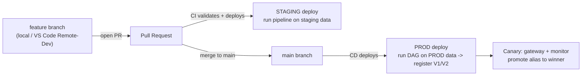

# Predictive Maintenance MLOps — Demo Runbook

End-to-end ML in Snowflake, code-first: a data scientist's notebook is productionized
by an ML engineer using Cortex Code, promoted DEV -> PROD, and rolled out safely with a
canary. This runbook is the on-stage script + a concept primer + the exact commands.

---

## 0. Concept primer (say this up front)

- **Model Registry** — Snowflake's versioned store for models (`PREDICTIVE_MAINTENANCE_MODEL` with versions `V1`, `V2`). Holds metrics, lineage, aliases, and the deployed services. Think "git for models."
- **Model version alias** — a movable label on a version (e.g. `PRODUCTION`). You promote by pointing the alias at a new version instead of changing downstream code. System aliases: `DEFAULT`, `FIRST`, `LAST`.
- **Feature Store** — managed, versioned feature definitions with point-in-time correctness. Our `MACHINE_SENSORS_LAG_FEATURES` view computes 3-day lag features per machine; it feeds both training and scoring so there's no train/serve skew.
- **Dataset** — an immutable, versioned snapshot generated from the Feature Store for a training run. Carries lineage (model -> dataset -> feature view).
- **ML Job** — runs arbitrary Python on a **compute pool** (container runtime), submitted from anywhere (`submit_directory`, `@remote`). This is how we run data prep / training remotely, at scale, without moving data.
- **Compute pool** — the container compute that runs ML Jobs and inference services (`PDM_POOL_PROD`). A **warehouse** (`PDM_WH_PROD`) runs the SQL / Function steps. We isolate compute per environment.
- **Task Graph (DAG)** — Snowflake's native scheduler. Each node is a task; here each task runs one pipeline step as an ML Job: `PREPARE_DATA -> [TRAIN_V1, TRAIN_V2] -> EVALUATE -> NOTIFY`. Deployed once, runs on a schedule.
- **Inference service** — a model version deployed as an autoscaling HTTPS server on a compute pool (SPCS). `mv.create_service(...)` gives it an endpoint you can call with JSON. `PDM_SERVICE_V1` and `PDM_SERVICE_V2` are our two.
- **Auto Capture** — automatically logs every request+response of an inference service to an inference table (no pipeline to build). Powers monitoring and A/B testing.
- **Gateway** — a **stable URL in front of one or more inference services** that splits or shadows traffic between them. When a service is recreated its own hostname changes, but the gateway URL is permanent. We use `traffic_split` (90% V1 / 10% V2) for a canary; change weights with `ALTER GATEWAY`; it also auto-fails-over to healthy targets.
- **Gateway model monitor** — reads the services' auto-captured logs (joined to a ground-truth table) and computes **drift** (distribution shift, e.g. PSI) and **performance** (F1/precision/recall/accuracy) **per service**, so you can compare a baseline vs a challenger live.
- **Cortex Code (CoCo) `/machine-learning` skill** — the agent that does the productionization: converting the notebook to modular ML-Job scripts, wiring the DAG, deploying services, creating the gateway + monitors.

Rule of thumb: **Experiments = choose during dev; Model Registry = govern/promote/deploy; Model Monitors = production.**

---

## 1. The story / personas

1. **Data Scientist** built `notebooks/end-2-end-mlops-demo.ipynb` in Snowsight Workspaces (DEV = `AI_DEMOS`). It generates data, engineers features, trains, registers, deploys, and monitors — all in one notebook.
2. **ML Engineer** uses **CoCo** to productionize it: modular pipeline, remote ML Jobs, a scheduled Task Graph, DEV -> PROD promotion, and a canary rollout of a new model.

Environments (isolated compute):

| Env | Database | Compute pool | Warehouse |
|-----|----------|--------------|-----------|
| DEV | `AI_DEMOS` | `SYSTEM_COMPUTE_POOL_CPU` | `AI_WH` |
| PROD | `AI_DEMOS_PROD` | `PDM_POOL_PROD` | `PDM_WH_PROD` |

Two models compared in the canary: **V1 = LogisticRegression (baseline)**, **V2 = XGBoost (candidate)**.

---

## 2. Live demo sequence

### Act 1 — The notebook (experimentation)
- Open `notebooks/end-2-end-mlops-demo.ipynb` in Snowsight Workspaces. It runs end-to-end on DEV; show the Feature Store, Experiment, registered model, SPCS service, and monitor.
- Point: same notebook runs locally or via the **VS Code Remote Development extension** (next step, below) because it uses `get_active_session()`.

### Act 2 — CoCo productionizes it (the agentic part)
Use these prompts (verbatim) with the `/machine-learning` skill:

| What you say to CoCo | What it produces |
|---|---|
| "Convert this notebook into an ML pipeline with separate data_prep, train, and eval modules." | `src/pdm_pipeline/{common,prepare_data,train_v1,train_v2,evaluate,notify}.py` |
| "Submit each step as an ML Job on my CPU compute pool." | `scripts/submit_step.py`, `scripts/submit_pipeline.py` using `submit_directory(...)` |
| "Log both models to the registry with precision/recall/F1 and track each run as an experiment." | `Registry.log_model(..., metrics=...)` + `ExperimentTracking` |
| "Create a Task Graph that runs this pipeline and can be scheduled." | `scripts/dag.py` — `DAGTask` per step |

Run it:
```bash
# each step individually (test in isolation):
SNOWFLAKE_CONNECTION_NAME=oregon_tp PDM_ENV=DEV python scripts/submit_step.py prepare_data
# or the whole chain as sequential ML Jobs:
SNOWFLAKE_CONNECTION_NAME=oregon_tp PDM_ENV=DEV python scripts/submit_pipeline.py
# or deploy + trigger the DAG:
SNOWFLAKE_CONNECTION_NAME=oregon_tp PDM_ENV=DEV python scripts/dag.py --run
```
Show the run in **Snowsight -> Monitoring -> Task History** (`PREPARE_DATA -> [TRAIN_V1, TRAIN_V2] -> EVALUATE -> NOTIFY`).

### Act 3 — Promote DEV -> PROD
- Generate PROD's own data (distinct from DEV): `python infra/generate_prod_data.py`.
- Run the same pipeline against PROD (`PDM_ENV=PROD`) — registers **V1** and **V2** in `AI_DEMOS_PROD`. In the real demo this is triggered by **git** (see Section 4).

### Act 4 — Safe rollout with a canary (prompts from the deck)

| What you say to CoCo | What it produces |
|---|---|
| "Deploy V1 and V2 as real-time serving endpoints with auto-capture." | `scripts/deploy_services.py` -> `mv.create_service(..., autocapture=True)` |
| "Create a gateway sending 90% to V1 and 10% to V2." | `infra/create_gateway.sql` -> `CREATE GATEWAY ... traffic_split` |
| "Send some test traffic through the gateway." | `scripts/simulate_traffic.py` (POSTs to the gateway `/predict`) |
| "Set up an A/B monitor and compare drift and accuracy between V1 and V2." | `CREATE MODEL MONITOR` + `MODEL_MONITOR_*_METRIC()` |
| "Shift all traffic to V2." / "Roll back to V1." | `ALTER GATEWAY ...` weights + `ALTER MODEL ... SET ALIAS` |

Commands:
```bash
python scripts/deploy_services.py            # V1 + V2 SPCS services (ingress + auto-capture)
# gateway 90/10:
snowsql/execute infra/create_gateway.sql
python scripts/simulate_traffic.py           # traffic through the gateway
# ground-truth table + gateway monitor + metric queries:
snowsql/execute infra/create_monitor.sql
```
Query the A/B result (SQL that matches the Snowsight gateway dashboard):
```sql
-- Performance per service (pass '1 HOUR' granularity; let start/end default; SERVICE unquoted)
SELECT * FROM TABLE(MODEL_MONITOR_PERFORMANCE_METRIC(
  'AI_DEMOS_PROD.IOT_PREDICTIVE_MAINTENANCE_MODEL_REGISTRY.PDM_GATEWAY_MONITOR',
  'F1_SCORE', '1 HOUR',
  SERVICE => AI_DEMOS_PROD.IOT_PREDICTIVE_MAINTENANCE_MODEL_REGISTRY.PDM_SERVICE_V2));

-- Drift (PSI) V2 vs V1 baseline
SELECT * FROM TABLE(MODEL_MONITOR_DRIFT_METRIC(
  'AI_DEMOS_PROD.IOT_PREDICTIVE_MAINTENANCE_MODEL_REGISTRY.PDM_GATEWAY_MONITOR',
  'POPULATION_STABILITY_INDEX', 'FAILURE_IN_1_DAY_PREDICTION', '1 HOUR',
  SERVICE => AI_DEMOS_PROD.IOT_PREDICTIVE_MAINTENANCE_MODEL_REGISTRY.PDM_SERVICE_V2,
  BASE_SERVICE => AI_DEMOS_PROD.IOT_PREDICTIVE_MAINTENANCE_MODEL_REGISTRY.PDM_SERVICE_V1));
```
Result to narrate: **both ~97% accurate, but V1 F1 = 0 (predicts "no failure" for everything) while V2 F1 = 0.55, precision 1.0, recall 0.375.** Accuracy alone misleads on rare-event data; the canary reveals V2 is the real winner. Then promote:
```sql
-- widen then promote
ALTER GATEWAY ... weights 50/50;
ALTER GATEWAY ... weights 1/99;   -- V2 gets traffic; V1 kept warm for rollback (use 0/100 for hard cutover)
ALTER MODEL AI_DEMOS_PROD.IOT_PREDICTIVE_MAINTENANCE_MODEL_REGISTRY.PREDICTIVE_MAINTENANCE_MODEL
  VERSION V2 SET ALIAS = PRODUCTION;   -- alias is an identifier, not a quoted string
```

---

## 3. Objects created (reference)

- DBs: `AI_DEMOS` (DEV), `AI_DEMOS_PROD` (PROD). Schema `IOT_PREDICTIVE_MAINTENANCE` (+ `_FEATURE_STORE`, `_MODEL_REGISTRY`).
- Compute: pools `SYSTEM_COMPUTE_POOL_CPU` (DEV), `PDM_POOL_PROD`; warehouses `AI_WH` (DEV), `PDM_WH_PROD`.
- Model `PREDICTIVE_MAINTENANCE_MODEL` V1 (LogReg) / V2 (XGBoost, alias `PRODUCTION`).
- Services `PDM_SERVICE_V1`, `PDM_SERVICE_V2`; gateway `PDM_GATEWAY`; monitor `PDM_GATEWAY_MONITOR`; ground truth `PDM_GROUND_TRUTH`.
- DAG `PDM_TRAINING_PIPELINE`.

---

## 4. Step 6 — How promotion is done in Git (CI/CD, DEV -> PROD)

**Core principle: you promote *code*, not the model binary.** The git repo (the `src/pdm_pipeline` scripts, `pipeline.yaml`/`dag.py`, feature-store definitions) is the source of truth. Each environment runs *its own* copy of the pipeline against *its own* data, producing its own registered model versions. The `PRODUCTION` alias and the canary decide which version serves — inside PROD.

### Branch/promotion flow


1. **Develop on a feature branch.** Change a training script / feature view. Open a PR.
2. **PR checks (CI)** run automatically: lint + `py_compile`, and a dry deploy to a **STAGING** database (`snow` CLI / python running `scripts/dag.py` with `PDM_ENV=STAGING`). Optionally trigger the DAG and assert it completes + metrics are sane. This is the merge gate.
3. **Merge to `main` (CD)** deploys to **PROD**: the workflow checks out `main`, connects to Snowflake with a **service account + key-pair** (headless — no browser), and runs `PDM_ENV=PROD python scripts/dag.py --run`. This (re)deploys the Task Graph and runs it on PROD data, registering fresh `V1`/`V2` in `AI_DEMOS_PROD`.
4. **Promotion inside PROD** (last mile) is the canary: deploy both versions, shift gateway weights, compare with the monitor, then `ALTER MODEL ... SET ALIAS = PRODUCTION` on the winner (or roll back). This can be gated on the monitor metrics.

### Two ways to run the deploy from CI
- **External runner (GitHub Actions)** — a workflow runs Python against Snowflake. Sketch:
  ```yaml
  # .github/workflows/deploy.yml
  on:
    pull_request: { branches: [main] }          # -> STAGING
    push: { branches: [main] }                   # -> PROD
  jobs:
    deploy:
      runs-on: ubuntu-latest
      steps:
        - uses: actions/checkout@v4
        - uses: actions/setup-python@v5
          with: { python-version: '3.10' }
        - run: pip install "snowflake-ml-python>=1.42" "snowflake.core>=1.12"
        - name: Deploy pipeline
          env:
            SNOWFLAKE_ACCOUNT: ${{ secrets.SF_ACCOUNT }}
            SNOWFLAKE_USER: ${{ secrets.SF_SVC_USER }}
            SNOWFLAKE_PRIVATE_KEY: ${{ secrets.SF_PRIVATE_KEY }}   # key-pair, headless
            PDM_ENV: ${{ github.event_name == 'push' && 'PROD' || 'STAGING' }}
          run: python scripts/dag.py --run
  ```
  Detect changed directories to deploy only what changed (feature views vs pipeline).
- **Snowflake Git integration (in-Snowflake)** — register the repo as a Snowflake object and run deploy scripts server-side:
  ```sql
  CREATE OR REPLACE GIT REPOSITORY pdm_repo
    API_INTEGRATION = <git_api_integration>
    ORIGIN = 'https://github.com/<org>/<repo>';
  ALTER GIT REPOSITORY pdm_repo FETCH;
  EXECUTE IMMEDIATE FROM @pdm_repo/branches/main/infra/setup_compute.sql;
  ```
  CI just calls `ALTER GIT REPOSITORY ... FETCH` + `EXECUTE IMMEDIATE FROM @repo/...`.

### Auth for CI (headless)
Local dev caches the SSO token (`client_store_temporary_credential = true` on `oregon_tp`). CI must be **key-pair** (no browser): generate an RSA key, `ALTER USER <svc> SET RSA_PUBLIC_KEY=...`, store the private key as a GitHub secret, connect with `authenticator=SNOWFLAKE_JWT`. Use a least-privilege **service account** for PROD, not a human SSO user.

---

## 5. Next step — run it from a local IDE (Private Preview)

The **Snowflake Remote Development extension for VS Code** creates a Snowflake-backed dev environment you reach over Remote-SSH; notebooks/scripts run on Snowflake-managed compute. Because it uses `get_active_session()`, this exact notebook and pipeline run unchanged. Enable `snowflake.enablePrivatePreviewFeatures`, install Remote-SSH, pick a compute pool, mount the workspace.

---

## 6. Gotchas we hit (so the demo goes smoothly)

- Notebook must be **dual-mode**: `try get_active_session() except Session.builder...`.
- Pipeline **owns a fresh model** each run (drop model + its services in `prepare_data`) to avoid version-collision / default-alias / service-reference errors.
- **Versions:** local `snowflake.core >= 1.12` + `snowflake-ml-python >= 1.42` are needed for `DAGTask(definition=<ML Job>)` deploy; the container runtime is already recent.
- `@remote` job function name must start with a letter (drives the service DNS name).
- Local `Registry` import needs `coverage >= 7.15` (numba/shap).
- **PAT to the gateway needs `MINS_TO_BYPASS_NETWORK_POLICY_REQUIREMENT`** when the account has no network policy (else 401 "Network policy is required").
- Monitor metric functions: pass `'1 HOUR'` granularity, **let start/end default**, and pass `SERVICE`/`BASE_SERVICE` as **unquoted identifiers**.
- Model alias via SQL: `ALTER MODEL ... VERSION V2 SET ALIAS = PRODUCTION` (unquoted).
