# Predictive Maintenance MLOps Demo

End-to-end, **code-first** MLOps on Snowflake for IoT predictive maintenance — from a data
scientist's exploratory notebook to a production pipeline of **ML Jobs** orchestrated as a
**Task Graph**, promoted **DEV → PROD**, and rolled out safely with a **canary gateway**
and **A/B model monitoring**. Built and driven from an IDE with **Cortex Code (CoCo)**.

Model: predict equipment failure **1 day ahead**. Canary pair: **V1 = LogisticRegression
(baseline)** vs **V2 = XGBoost (candidate)**.

> New here? Read `DEMO_RUNBOOK.md` for the concept primer + on-stage run order, and
> `DEMO_PLAN.md` for the full plan and build status.

## The story (two personas)

1. **Data Scientist** builds `notebooks/end-2-end-mlops-demo.ipynb`. Same notebook runs in Snowsight or from VS Code via the Remote Development extension (Private Preview) — editing local, compute on Snowflake.
2. **ML Engineer** uses **Cortex Code** to productionize it: split into modular scripts, run
   each step as a remote **ML Job**, wire them into a scheduled **Task Graph**, promote
   **DEV → PROD**, then **canary** a new model with a gateway + monitors before promoting it.

## Architecture

```mermaid
flowchart LR
  NB["Notebook (DEV)\nexperimentation"] --> PKG["Modular pipeline\nprepare / train_v1 / train_v2 / evaluate / notify"]
  PKG --> JOBS["ML Jobs on a compute pool"]
  JOBS --> DAG["Task Graph DAG\n(scheduled)"]
  DAG --> PROD["PROD (AI_DEMOS_PROD)\nregister V1 + V2"]
  PROD --> SVC["SPCS services V1 / V2\n(auto-capture)"]
  SVC --> GW["Gateway (90/10 -> V2)"]
  GW --> MON["Gateway A/B monitor\ndrift + performance"]
  MON --> PROMO["Promote winner\ntraffic + PRODUCTION alias"]
```



## Key Snowflake ML features demonstrated

| Feature | Where |
|---------|-------|
| **Feature Store** | lag features, incremental refresh (`prepare_data`) |
| **Dataset** | versioned training snapshot with lineage |
| **Experiment Tracking** | per-run metrics for LogReg vs XGBoost |
| **Model Registry** | versions V1/V2, metrics, `PRODUCTION` alias |
| **ML Jobs** | each pipeline step runs on a compute pool |
| **Task Graph (DAG)** | `PREPARE_DATA → [TRAIN_V1, TRAIN_V2] → EVALUATE → NOTIFY` |
| **SPCS model serving** | `V1`/`V2` real-time inference services |
| **Gateway** | stable URL + traffic split for canary/blue-green |
| **Auto Capture + Gateway Monitor** | live drift + performance A/B (V1 vs V2) |

## Environments

| Env | Database | Compute pool | Warehouse |
|-----|----------|--------------|-----------|
| DEV | `AI_DEMOS` | `SYSTEM_COMPUTE_POOL_CPU` | `AI_WH` |
| PROD | `AI_DEMOS_PROD` | `PDM_POOL_PROD` | `PDM_WH_PROD` |

Schema (both): `IOT_PREDICTIVE_MAINTENANCE` (+ `_FEATURE_STORE`, `_MODEL_REGISTRY`).

## Prerequisites

- Snowflake account with ML features (Feature Store, Model Registry, SPCS, Gateway, Model Monitor).
- A named connection (default `oregon_tp`); set `SNOWFLAKE_CONNECTION_NAME`.
- Python env with `snowflake-ml-python>=1.42`, `snowflake.core>=1.12`, `snowflake-snowpark-python`,
  `xgboost`, `scikit-learn`, `pandas` (for submitting jobs / deploying services locally).
- Compute provisioned via `infra/setup_compute.sql`. No separate `environment.setup.sql` is
  needed — `demo_functions.setup()` bootstraps schemas + demo data; `infra/generate_prod_data.py`
  builds the PROD dataset.

## Quick start

```bash
# 1. Phase 1 - open the notebook (DEV, runs in Snowsight or locally)
#    notebooks/end-2-end-mlops-demo.ipynb

# 2. Provision compute
#    execute infra/setup_compute.sql

# 3. Phase 2 - run the pipeline (DEV): one step, or the whole chain, or the DAG
SNOWFLAKE_CONNECTION_NAME=oregon_tp PDM_ENV=DEV python scripts/submit_step.py train_v1
SNOWFLAKE_CONNECTION_NAME=oregon_tp PDM_ENV=DEV python scripts/submit_pipeline.py
SNOWFLAKE_CONNECTION_NAME=oregon_tp PDM_ENV=DEV python scripts/dag.py --run

# 4. Promote to PROD (its own data), then run the pipeline there
SNOWFLAKE_CONNECTION_NAME=oregon_tp python infra/generate_prod_data.py
SNOWFLAKE_CONNECTION_NAME=oregon_tp PDM_ENV=PROD python scripts/dag.py --run

# 5. Canary: deploy V1/V2, gateway 90/10, traffic, monitor, then promote
SNOWFLAKE_CONNECTION_NAME=oregon_tp PDM_ENV=PROD python scripts/deploy_services.py
#    execute infra/create_gateway.sql
SNOWFLAKE_CONNECTION_NAME=oregon_tp PDM_ENV=PROD python scripts/simulate_traffic.py
#    execute infra/create_monitor.sql   (ground truth + monitor + metric queries)
```

Full step-by-step (with the Cortex Code prompts and the SQL): see `DEMO_RUNBOOK.md`.

## Project structure

```
ml_ops_e2e/
├── notebooks/
│   └── end-2-end-mlops-demo.ipynb     # Phase 1: dual-mode DS notebook
├── src/
│   ├── demo_functions/                # data generation + setup (db-parametrized)
│   └── pdm_pipeline/                  # Phase 2: modular production pipeline
│       ├── common.py                  # env config, dual-mode session, constants
│       ├── prepare_data.py            # Feature Store + Dataset (ML Job)
│       ├── train_v1.py                # LogisticRegression -> V1 (ML Job)
│       ├── train_v2.py                # XGBoost -> V2 (ML Job)
│       ├── evaluate.py                # compare versions
│       └── notify.py                  # finalizer
├── scripts/
│   ├── run_pipeline.py                # local in-process chain (debug)
│   ├── submit_step.py                 # run one step as an ML Job
│   ├── submit_pipeline.py             # run all steps as ML Jobs (one session)
│   ├── dag.py                         # deploy/run the Task Graph
│   ├── deploy_services.py             # V1/V2 SPCS services (ingress + auto-capture)
│   └── simulate_traffic.py            # send traffic through the gateway
├── infra/
│   ├── setup_compute.sql              # per-env compute pools + warehouses
│   ├── generate_prod_data.py          # provision AI_DEMOS_PROD data
│   ├── create_gateway.sql             # gateway 90/10 (+ rollout ALTERs)
│   └── create_monitor.sql             # ground truth + gateway monitor + metric queries
├── DEMO_PLAN.md                       # plan + build status
├── DEMO_RUNBOOK.md                    # concepts + on-stage sequence + CoCo prompts
├── pyproject.toml                     # packages src/ (enables notebook `pip install -e ..`)
└── README.md
```

## Sample use case

**Scenario:** a facility monitors 200 machines with 3 sensors each; predict failures 1 day
ahead to enable proactive maintenance.

**Data pattern:** normal sensors 0–1; pre-failure drift shifts to 1–3; failures occur 3–4
days after anomalies begin. The canary uses post-drift data so the A/B comparison is
meaningful — revealing that "97% accurate" V1 actually catches **zero** failures (F1 = 0)
while V2 does (F1 ≈ 0.55).

## Notes

- CI/CD (git-driven DEV→PROD promotion) is **documented** in `DEMO_RUNBOOK.md` §4 but not yet implemented.
- Next step: run the notebook from a local IDE via the **VS Code Remote Development extension** (Private Preview).

## Acknowledgements

This demo was originally inspired by Michael Gorkow's
[predictive-maintenance-mlops-demo](https://github.com/michaelgorkow/snowflake-ai-demos/tree/main/predictive-maintenance-mlops-demo),
part of the [snowflake-ai-demos](https://github.com/michaelgorkow/snowflake-ai-demos) collection.
The original notebook provided the starting point for the data-scientist workflow shown here
